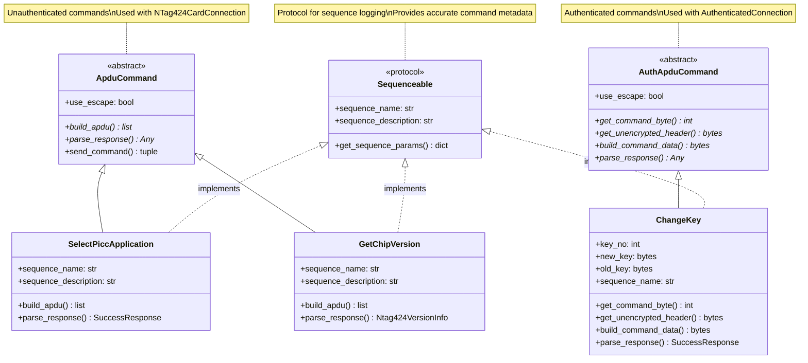

# NTAG424 SDM Provisioner - Architecture

**TLDR;** Service-oriented architecture with three core services (Provisioning, Diagnostics, Maintenance) that encapsulate all business logic. Services are UI-agnostic and reusable across TUI, CLI, and future API interfaces. TUI is the primary user interface, using WorkerManager for async operations. Command layer provides low-level APDU operations. HAL abstracts hardware. Crypto layer is verified against NXP specifications.

**Last Updated**: 2025-11-30  
**Status**: Production Ready ✅ | Service Layer + Sequenceable Protocol

---

## System Overview

The NTAG424 SDM Provisioner uses a **service-oriented architecture** where all business logic is encapsulated in reusable service classes. The architecture follows the PRD requirements for separation of concerns, testability, and maintainability.

### Key Features
- ✅ **Service Layer Pattern** - All business logic in services (ProvisioningService, TagDiagnosticsService, TagMaintenanceService)
- ✅ **UI-Agnostic Services** - Services use callbacks for progress, no UI dependencies
- ✅ **TUI as Primary Interface** - Text User Interface using Textual framework
- ✅ **WorkerManager** - Centralized async operation management for TUI
- ✅ **Type-safe Commands** - ApduCommand vs AuthApduCommand
- ✅ **EV2 Authentication** - Full two-phase protocol
- ✅ **Auto-Chunking** - HAL handles large writes/reads transparently
- ✅ **Hardware Abstraction** - CardConnection interface isolates hardware specifics
- ✅ **Hardware Validated** - Tested with real NTAG424 tags

---

## Service Layer Architecture (Per PRD Section 5.1)


**Service Layer Principles** (Per PRD):
- **Single Responsibility**: Each service handles one domain (provisioning, diagnostics, maintenance)
- **Dependency Injection**: Services receive CardConnection and KeyManager via constructor
- **UI-Agnostic**: Services use callbacks for progress, no direct UI dependencies
- **Testable**: Services can be unit tested with mocks
- **Reusable**: Same services work for TUI, CLI, and future API

**BaseService Pattern** (Planned):
- Common base class for all services
- Provides `_authenticate()`, `_log()`, error handling
- Ensures consistency across services

## Architecture Layers


**Layer Responsibilities**:
- **UI Layer**: User interface (TUI screens, CLI menus) - no business logic
- **Service Layer**: Business logic (provisioning, diagnostics, maintenance) - UI-agnostic
- **Command Layer**: Low-level APDU operations (GetChipVersion, ChangeKey, etc.)
- **Crypto Layer**: Cryptographic primitives (CMAC, encryption, session keys)
- **HAL Layer**: Hardware abstraction (CardConnection interface)
- **Hardware**: Physical NFC reader and tags

---

## Service Layer Architecture (Per PRD Section 5.1)

### Service Classes


**Service Principles** (Per PRD):
- **UI-Agnostic**: Services use callbacks for progress, no direct UI dependencies
- **Dependency Injection**: Services receive `CardConnection` and `KeyManager` via constructor
- **Single Responsibility**: Each service handles one domain
- **Testable**: Services can be unit tested with mocks (no hardware dependency)
- **Reusable**: Same services work for TUI, CLI, and future API

**Current Implementation Status**:
- ✅ `ProvisioningService`: Implemented and integrated with TUI
- ✅ `TagDiagnosticsService`: Implemented with unit tests
- ⚠️ `TagMaintenanceService`: Not yet implemented (planned)
- ⚠️ `BaseService`: Not yet implemented (planned per PRD feedback)

### TUI Integration Pattern


**Key Pattern**: TUI screens delegate to WorkerManager, which runs services asynchronously. Services use callbacks to update UI progress.

---

## Command Architecture

### Command Hierarchy



### Sequenceable Protocol

Commands implement the `Sequenceable` protocol for accurate sequence logging:

```python
@runtime_checkable
class Sequenceable(Protocol):
    """Protocol for commands that provide sequence metadata."""
    
    @property
    def sequence_name(self) -> str:
        """Human-readable name for sequence diagram."""
        ...
    
    @property
    def sequence_description(self) -> str:
        """Brief description of command purpose."""
        ...
    
    def get_sequence_params(self) -> dict[str, str]:
        """Key parameters for detailed logging."""
        ...
```

**Benefits**:
- Sequence diagrams show accurate command names (not just class names)
- Parameters are captured for debugging (key numbers, file IDs, etc.)
- HAL automatically uses `Sequenceable` interface when available
- Fallback to class name for commands that don't implement it

### SequenceLogger

The `SequenceLogger` captures actual APDU commands as they execute at the HAL level:

```python
# Start sequence logging
seq = start_sequence("Provisioning")

# Commands are automatically logged by HAL.send()
card.send(SelectPiccApplication())  # Logged!
card.send(GetChipVersion())         # Logged!

# Render sequence diagram
print(seq.render_diagram())
```

**Output**:
```
============================================================
  SEQUENCE DIAGRAM
============================================================
  Host                              Tag
   │                                 │
   │──── SelectPiccApplication ────▶│
   │◀──── ✓ OK (9000) ──────────────│
   │                                 │
   │──── GetChipVersion ───────────▶│
   │◀──── ✓ OK (9100) ──────────────│
============================================================
  Total: 2 commands | ✓ 2 success | ❌ 0 errors
============================================================
```

**Key Features**:
- Logs actual commands as executed (not planned commands)
- Uses `Sequenceable` interface for accurate names
- Captures timing, status words, and errors
- Renders ASCII sequence diagrams for debugging
- Integrated with TUI for real-time visualization

### Command Pattern (Inverted Control)

**New Pattern** (Enforced):
```python
# Connection executes command
result = card.send(Command())
```

**Old Pattern** (Removed from base, special cases only):
```python
# Command executes itself (DEPRECATED)
result = Command().execute(card)
```

**Why Inverted**:
- Connection controls execution context
- Easier to mock/test
- Clear separation: Command = data, Connection = execution
- Consistent with modern frameworks

---

## Authentication Flow

### EV2 Authentication Classes


**Key Insight**: `AuthenticateEV2` is NOT a command - it's a protocol orchestrator that returns an `AuthenticatedConnection` context manager.

### Authentication Session Lifecycle


---

## Provisioning Workflow Architecture

### Service-Based Workflow (Current)


**Error Handling** (Per PRD Section 5.4):
- **Retry Mechanism**: Up to 3 retries with 1-second delay
- **Recovery Strategy**: Idempotent operations (safe to retry)
- **Partial State Detection**: Service detects where provisioning failed
- **User Feedback**: Clear error messages via progress callbacks

**Key Rotation Warnings** (Per PRD Section 4.1):
- **Key 0 (Master Key)**: Requires explicit user confirmation (destructive)
- **Keys 1-4 (Application Keys)**: Standard rotation, less critical
- **Warning Display**: TUI shows confirmation dialog before Key 0 rotation

---

## Crypto Architecture

### Crypto Primitives (Single Source of Truth)


**Key Principle**: ALL crypto operations delegate to `crypto_primitives.py`. No duplicated crypto logic anywhere.

### Session Key Derivation (NXP Section 9.1.7)

```
SV = 0xA5 || 0x33 || (01h) || 00h 00h || 00h || RndA[15:14] || 
     0x5A || 0x33 || (01h) || 00h 00h || 00h || RndA[13:8] ||
     0xA5 || 0x33 || (02h) || 00h 00h || 00h || RndA[7:2] ||
     0x5A || 0x33 || (02h) || 00h 00h || 00h || RndA[1:0] || RndB[15:14]

SesAuthENCKey = CMAC(AuthKey, SV[0:15])
SesAuthMACKey = CMAC(AuthKey, SV[16:31])
```

**Critical**: 32-byte SV with XOR operations, not simplified 8-byte version.

---

## Key Management Architecture


**Two-Phase Commit**:
```python
with key_mgr.provision_tag(uid, url=url) as new_keys:
    # Generate and save keys (status='pending')
    auth_conn.send(ChangeKey(0, new_keys.get_picc_master_key_bytes(), None))
    auth_conn.send(ChangeKey(1, new_keys.get_app_read_key_bytes(), None))
    auth_conn.send(ChangeKey(3, new_keys.get_sdm_mac_key_bytes(), None))
    # Context exit: status='provisioned' (success) or 'failed' (exception)
```

**States**:
- `factory` - All keys are 0x00
- `pending` - Key 0 changed, Keys 1 & 3 not yet changed
- `provisioned` - All keys changed, NDEF written
- `failed` - Provisioning encountered error

---

## HAL (Hardware Abstraction Layer)


**Key Methods**:

**`send_apdu(apdu, use_escape)`**:
- Low-level APDU transmission
- Handles escape mode for ACR122U
- Returns: (data, sw1, sw2)

**`send(command)`**:
- New pattern for command execution
- Calls `command.build_apdu()` and `command.parse_response()`
- Type-safe dispatch

**`send_write_chunked(...)`**:
- Automatic chunking for large writes
- Splits data into 52-byte chunks
- Used by `WriteNdefMessage`

---

## Provisioning Orchestration

### Main Workflow


### Tag State Decision Logic


---

## Crypto Layer Details

### Encryption Flow


---

## Data Flow

### Provisioning Data Flow


### Key Storage Format (CSV)

```
uid,picc_master_key,app_read_key,sdm_mac_key,status,provisioned_date,notes
04536B4A2F7080,68882dc828f89a50...,99e8758eedc8da55...,2d543490d3691622...,provisioned,2025-11-08T...,https://...
```

**Fields**:
- `uid` - 7-byte UID (14 hex chars)
- `picc_master_key` - Key 0 (32 hex chars, 16 bytes)
- `app_read_key` - Key 1 (32 hex chars, 16 bytes)
- `sdm_mac_key` - Key 3 (32 hex chars, 16 bytes)
- `status` - factory | pending | provisioned | failed
- `provisioned_date` - ISO timestamp
- `notes` - URL or error message

---

## Error Handling Strategy

### Exception Hierarchy

```python
Ntag424Error (base)
├── ApduError
│   ├── AuthenticationError
│   ├── AuthenticationRateLimitError
│   └── IntegrityError
└── CommunicationError
```

### Error Propagation


**Key Points**:
- No silent failures (all errors raise exceptions)
- Two-phase commit protects database integrity
- Failed provisions save state for recovery

---

## Testing Strategy (Per PRD Section 6.1)

### Test Levels

**Unit Tests** (80%+ coverage target):
- `test_crypto_validation.py` - Crypto primitives vs NXP specs (100% coverage required)
- `test_diagnostics_service.py` - TagDiagnosticsService unit tests
- `test_provisioning_service.py` - ProvisioningService unit tests
- Individual command tests
- Key manager tests

**Integration Tests** (with simulator):
- Full authentication flow
- Key change sequences
- Factory reset scenarios
- Service layer integration

**Acceptance Tests** (with real hardware):
- End-to-end provisioning workflow
- Tag diagnostics workflow
- Factory reset workflow

**Test Strategy Principles** (Per PRD):
- **Incremental Unit Tests**: Test small units in isolation
- **Mock Hardware**: Unit tests use mocks (no hardware dependency)
- **Simulator**: Integration tests use SeritagCardSimulator
- **Real Hardware**: Acceptance tests only
- **No Dumb Tests**: Tests verify actual logic, not library functions

### Mock HAL (Current)

- `SeritagCardSimulator`: Simulates NTAG424 tag behavior
- Used for integration tests
- Supports authentication, key changes, file operations

---

## Performance Considerations

### Authentication Attempts
- **Cost**: Each failed auth attempt counts toward rate limit (3-5 max)
- **Mitigation**: Don't test auth upfront, trust database status
- **Recovery**: Wait 60+ seconds or use fresh tag

### Chunked Writes
- **Chunk Size**: 52 bytes (safe for ACR122U)
- **Overhead**: ~8 bytes per chunk (CLA, INS, P1, P2, LC, LE)
- **Example**: 182-byte NDEF → 4 chunks (52+52+52+26)

### Session Management
- **Session Lifetime**: Until Key 0 changes or explicit close
- **Re-authentication**: Required after Key 0 change
- **Counter**: Persists across commands in same session

---

## Security Considerations (Per PRD Section 5.3)

### Key Storage
- Keys stored in CSV file (`tag_keys.csv`)
- Automatic backups before changes
- **CRITICAL**: Secure this file (contains all tag keys)
- **PRD Requirement**: Encryption at rest (planned)

### Security Standards (Per PRD)
- ✅ **100% test coverage on crypto operations** (non-negotiable)
- ✅ **All crypto verified against NXP spec vectors**
- ✅ **No hardcoded secrets** in source code
- ⚠️ **Secure key storage** (encryption at rest - planned)
- ✅ **Cryptographic verification** of all operations

### Rate Limiting
- Protects against brute force attacks
- Counter persists in non-volatile memory
- 60+ second lockout after failures

### Key Change Validation
- Keys 1-4 require old key (XOR verification)
- Prevents unauthorized key changes
- Must know old key to compute new key

---

## Future Enhancements

### Planned (Per PRD & Sprint)
1. **TagMaintenanceService**: Factory reset and format operations
2. **BaseService**: Common base class for all services
3. **Key Encryption**: Encryption at rest for key storage (PRD requirement)
4. **Key Recovery**: Probe keys feature for lost key recovery
5. **Tag Type Detection**: NXP vs. Seritag compatibility detection

### Out of Scope (Per PRD Section 8)
- Batch provisioning UI (CLI only for now)
- Web API interface
- Mobile app
- Advanced key management UI
- Tag emulation/simulation mode
- Multi-tag operations

### Considered (Future)
1. Support for other readers (not just ACR122U)
2. Web dashboard
3. Advanced analytics
4. Cloud key management integration

---

## References

- **SUCCESSFUL_PROVISION_FLOW.md** - Captured trace of working flow
- **MINDMAP.md** - Project status and overview
- **charts.md** - Sequence diagrams
- **README.md** - Quick start guide
- **NXP AN12196** - NTAG 424 DNA features and hints
- **NXP AN12343** - Session key derivation specification

---

**Architecture Status**: ✅ Service-oriented, type-safe, production-ready  
**Code Quality**: ✅ SOLID principles, DRY, testable (per PRD Section 6.2)  
**Service Layer**: ✅ ProvisioningService, TagDiagnosticsService implemented  
**TUI Integration**: ✅ WorkerManager pattern for async operations  
**Proven Working**: ✅ See SUCCESSFUL_PROVISION_FLOW.md for evidence  
**PRD Alignment**: ✅ Architecture matches PRD Section 5 requirements
