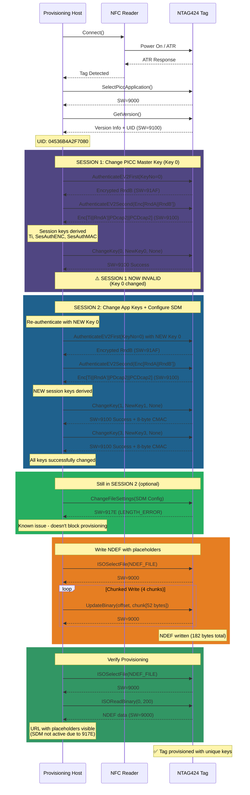
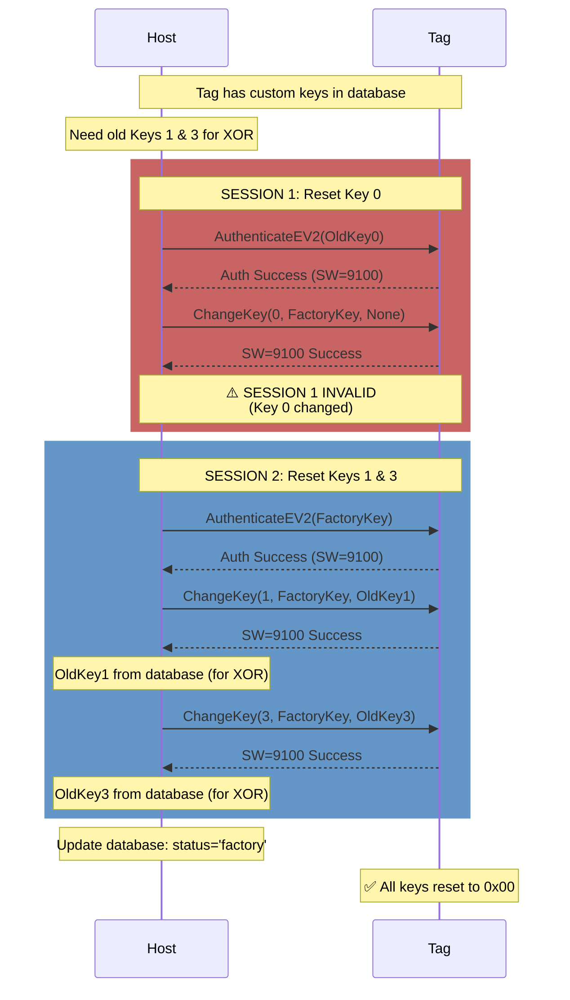
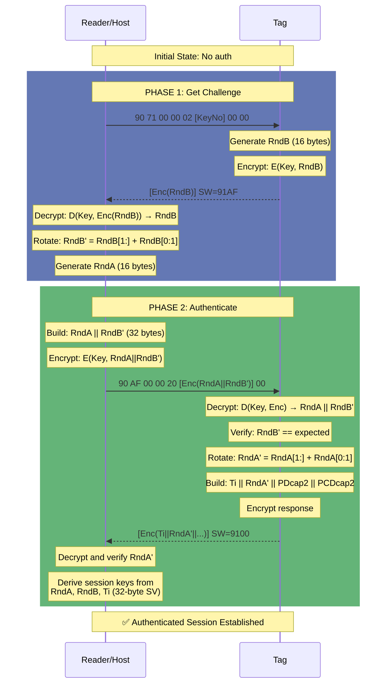
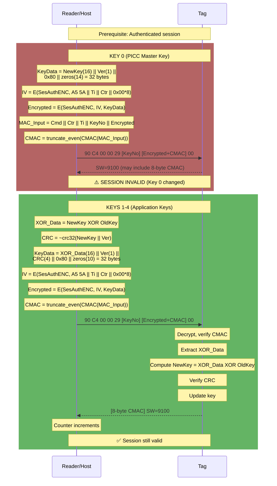
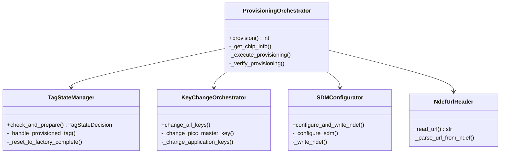
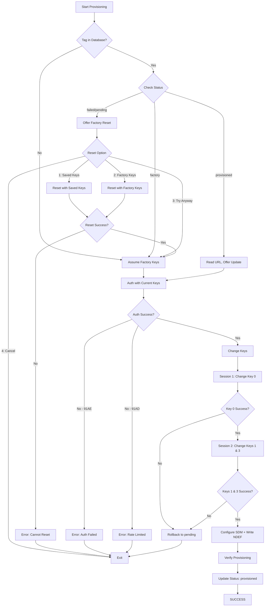
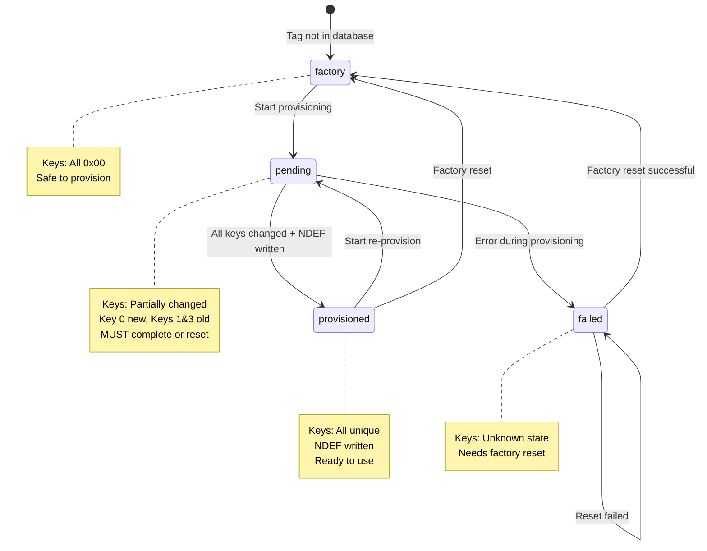
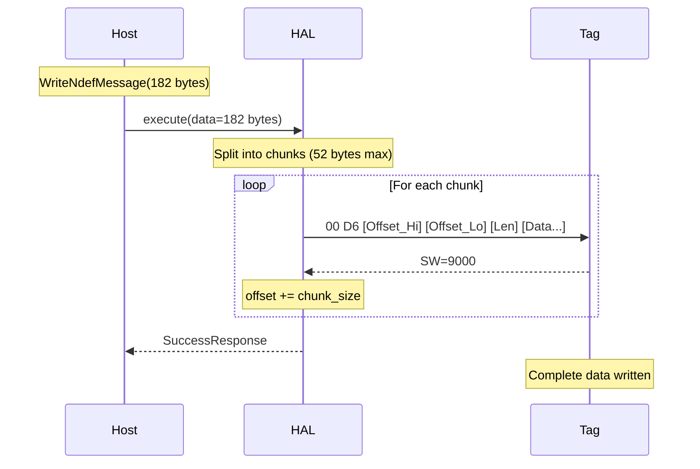

# NTAG424 DNA Provisioning - Sequence Diagrams

**TLDR;** Verified working flows: Two-session key change pattern (Session 1: Key 0 only, Session 2: Keys 1&3 + SDM config). Tool-based architecture with connection-per-operation. Auto-chunking for large writes. All traces from successful hardware runs.

This document contains sequence diagrams showing the actual, verified provisioning flow based on successful execution traces.

---

## Complete Provisioning Sequence (Verified Working)

This diagram shows the ACTUAL working flow with two separate authentication sessions.



---

## Factory Reset Sequence (Verified Working)

Shows how to reset a provisioned tag back to factory defaults.



---

## EV2 Authentication Protocol (Detailed)



---

## ChangeKey Protocol (Detailed)



---

## Command Flow Patterns

### New Pattern (Preferred)
```python
# Unauthenticated commands
card.send(SelectPiccApplication())
version = card.send(GetChipVersion())
settings = card.send(GetFileSettings(file_no=2))

# Authenticated commands
with AuthenticateEV2(key, key_no=0)(card) as auth_conn:
    auth_conn.send(ChangeKey(0, new_key, None))
    auth_conn.send(ChangeKey(1, new_key, None))
```

### Old Pattern (Special Cases Only)
```python
# Commands with special APDU handling
WriteNdefMessage(data).execute(card)
ReadNdefMessage().execute(card)
```

---

## Status Word Reference

| Code | Name | Meaning |
|------|------|---------|
| 9000 | OK | Success (ISO standard) |
| 9100 | OK_ALTERNATIVE | Success (NTAG424 alternative) |
| 91AF | MORE_DATA_AVAILABLE | Additional frame available (Phase 1 success) |
| 91AE | AUTHENTICATION_ERROR | Auth failed or session invalid |
| 911E | INTEGRITY_ERROR | CMAC verification failed |
| 917E | LENGTH_ERROR | Incorrect data length |
| 91AD | AUTHENTICATION_DELAY | Rate limiting active (wait 60s) |
| 6982 | SECURITY_NOT_SATISFIED | Auth required for operation |

---

## Critical Insights

### Two-Session Requirement
Changing Key 0 invalidates the current session because Key 0 is the PICC Master Key that governs the authentication context. This is BY DESIGN for security.

**Consequence**: Must use two separate auth sessions:
1. Auth with old Key 0 → Change Key 0 → Session invalid
2. Auth with NEW Key 0 → Change Keys 1 & 3

**Why This Works**:
- After Step 1, Key 0 is changed
- Tag still knows Key 0 (just changed it)
- Can immediately re-auth with NEW Key 0
- Session 2 has full access to change remaining keys

### Why Old Keys Needed for Keys 1-4

For security, Keys 1-4 use XOR with old key:
```
TagVerification:
  Receive: (NewKey XOR OldKey) from PCD
  Compute: NewKey = (NewKey XOR OldKey) XOR OldKey
  Verify: CRC32 matches
  Update: Store NewKey
```

This prevents unauthorized key changes - attacker must know old key to compute valid XOR.

### Counter and IV Relationship

```
Before Command:
  Counter = N
  IV = E(SesAuthENC, A5 5A || Ti || N || zeros)
  CMAC_Input = Cmd || N || Ti || Data

After Success (SW=9100):
  Counter = N + 1

After Failure (SW != 9100):
  Counter = N (unchanged)
```

This ensures IV and CMAC use consistent counter value.

---

## Provisioning Script Architecture

The refactored `22_provision_game_coin.py` uses clean OOP:



**Design Principles**:
- Single Responsibility Principle
- Composition over inheritance
- DRY (no duplicated NDEF parsing)
- YAGNI (only abstractions we need)
- Testable (each class independently testable)

---

## Error Handling Flow



---

## Key Management States



---

## Chunked Write Protocol

For large data (>52 bytes), writes are chunked:



**Why Chunking**:
- Reader buffer limits (~64 bytes total APDU)
- Tag buffer limits
- Reliable transmission

**Chunk Size**: 52 bytes (safe default for ACR122U)

---

## References

- See `SUCCESSFUL_PROVISION_FLOW.md` for complete APDU traces
- See `MINDMAP.md` for architecture overview
- See `ARCH.md` for detailed class diagrams

**Last Updated**: 2025-11-08  
**Status**: ✅ Verified working end-to-end
# NTAG424 DNA - APDU Packet Diagrams

Complete reference for all APDU commands used in the provisioning tool.

**Legend:**
- `[ ]` = Single byte
- `[...]` = Multiple bytes
- `LC` = Length of command data
- `LE` = Expected response length (0x00 = up to 256 bytes)

---

## Table of Contents

1. [Authentication Commands](#authentication-commands)
2. [Key Management Commands](#key-management-commands)
3. [File Management Commands](#file-management-commands)
4. [Data Access Commands](#data-access-commands)
5. [Information Commands](#information-commands)

---

## Authentication Commands

### 1. AuthenticateEV2First (Phase 1)

**Purpose:** Request encrypted challenge (RndB) from tag

**Command APDU:**
```
┌──────┬──────┬──────┬──────┬──────┬──────────┬────────┬──────┐
│ CLA  │ INS  │  P1  │  P2  │  LC  │  KeyNo   │ LenCap │  LE  │
├──────┼──────┼──────┼──────┼──────┼──────────┼────────┼──────┤
│ 0x90 │ 0x71 │ 0x00 │ 0x00 │ 0x02 │ 0x00-0x04│  0x00  │ 0x00 │
└──────┴──────┴──────┴──────┴──────┴──────────┴────────┴──────┘
         ^                           ^
         |                           |
    AuthenticateEV2              Key number (0-4)
    
Total: 8 bytes
```

**Response APDU:**
```
┌────────────────────────────────┬──────┬──────┐
│      Encrypted RndB (16)       │ SW1  │ SW2  │
├────────────────────────────────┼──────┼──────┤
│    [16 bytes of encrypted]     │ 0x91 │ 0xAF │
└────────────────────────────────┴──────┴──────┘
                                      ^     ^
                                      |_____|
                                   Additional Frame
                                   
Total: 18 bytes
```

---

### 2. AuthenticateEV2Second (Phase 2)

**Purpose:** Complete authentication with rotated RndA + RndB

**Command APDU:**
```
┌──────┬──────┬──────┬──────┬──────┬────────────────────────────────┬──────┐
│ CLA  │ INS  │  P1  │  P2  │  LC  │     Encrypted Data (32)        │  LE  │
├──────┼──────┼──────┼──────┼──────┼────────────────────────────────┼──────┤
│ 0x90 │ 0xAF │ 0x00 │ 0x00 │ 0x20 │  RndA'(16) || RndB'(16)        │ 0x00 │
└──────┴──────┴──────┴──────┴──────┴────────────────────────────────┴──────┘
         ^                                    ^
         |                                    |
    Additional Frame                 Both rotated left 1 byte
    
Total: 38 bytes
```

**Response APDU:**
```
┌────────────────────────────────┬──────┬──────┐
│      Encrypted Response (32)   │ SW1  │ SW2  │
├────────────────────────────────┼──────┼──────┤
│  Ti(4) || RndA'(16) || PDcap(6)│ 0x91 │ 0x00 │
│         || PCDcap(6)            │      │      │
└────────────────────────────────┴──────┴──────┘
           ^
           |
    Transaction Identifier
    
Total: 34 bytes
```

---

## Key Management Commands

### 3. ChangeKey (Authenticated)

**Purpose:** Change AES key with authentication

**Command APDU (Encrypted):**
```
┌──────┬──────┬──────┬──────┬──────┬────────┬──────────────────────────────┬──────┐
│ CLA  │ INS  │  P1  │  P2  │  LC  │ KeyNo  │   Encrypted Data + CMAC      │  LE  │
├──────┼──────┼──────┼──────┼──────┼────────┼──────────────────────────────┼──────┤
│ 0x90 │ 0xC4 │ 0x00 │ 0x00 │ 0x29 │ 0x00-04│  CryptoData(32) || CMAC(8)   │ 0x00 │
└──────┴──────┴──────┴──────┴──────┴────────┴──────────────────────────────┴──────┘
         ^                           ^                  ^
         |                           |                  |
     ChangeKey                Key number        Data encrypted with
                                              session ENC key, then MACed
                                              
Total: 47 bytes

Plaintext structure (before encryption):
┌──────────────────┬──────────┬─────────────┐
│  New Key (16)    │ Key Ver  │   CRC32     │
├──────────────────┼──────────┼─────────────┤
│  [16 bytes]      │   0x00   │ [4 bytes]   │
└──────────────────┴──────────┴─────────────┘
                                  ^
                                  |
                        CRC32(new_key XOR old_key)
                        For keys 1-4 only (key 0 uses zeros)
```

**CMAC Input:**
```
┌──────┬────────────┬──────┬────────┬─────────────────────┐
│ CMD  │ Counter(2) │  Ti  │ KeyNo  │   Encrypted Data    │
├──────┼────────────┼──────┼────────┼─────────────────────┤
│ 0xC4 │ Little-end │ [4]  │ 0x00-04│    [32 bytes]       │
└──────┴────────────┴──────┴────────┴─────────────────────┘

CMAC calculated with session MAC key, truncated to 8 bytes (odd indices)
```

---

## File Management Commands

### 4. ChangeFileSettings (Authenticated, with SDM)

**Purpose:** Configure file for Secure Dynamic Messaging

**Command APDU:**
```
┌──────┬──────┬──────┬──────┬──────┬────────┬──────────────────────────────┬──────┐
│ CLA  │ INS  │  P1  │  P2  │  LC  │ FileNo │   Encrypted Data + CMAC      │  LE  │
├──────┼──────┼──────┼──────┼──────��├────────┼──────────────────────────────┼──────┤
│ 0x90 │ 0x5F │ 0x00 │ 0x00 │ 0x19 │  0x02  │  CryptoData(16) || CMAC(8)   │ 0x00 │
└──────┴──────┴──────┴──────┴──────┴────────┴──────────────────────────────┴──────┘
         ^                           ^                  ^
         |                           |                  |
  ChangeFileSettings            NDEF file         Encrypted + MACed
  
Total: 31 bytes

Plaintext structure (before encryption, 12 bytes + padding):
┌────────────┬──────────────┬────────────┬─────────────────┬────────────┬────────────┬─────────┐
│ FileOption │ AccessRights │ SDMOptions │ SDMAccessRights │ UIDOffset  │ CtrOffset  │ Padding │
├────────────┼──────────────┼────────────┼─────────────────┼────────────┼────────────┼─────────┤
│    0x40    │   0xEE 0xE0  │    0xC1    │    0xFE 0xEF    │  [3 bytes] │ [3 bytes]  │ 0x80... │
└────────────┴──────────────┴────────────┴─────────────────┴────────────┴────────────┴─────────┘
     ^              ^              ^              ^
     |              |              |              |
  SDM_ENABLED   RW|Chg    UID|CTR|ASCII    RFU|CtrRet
   (bit 6)      Rd|Wr       encoding       Meta|FileRd
```

**Field Breakdown:**

```
FileOption (1 byte):
┌───┬───┬───┬───┬───┬───┬────────┬──────────┐
│ 7 │ 6 │ 5 │ 4 │ 3 │ 2 │   1    │    0     │
├───┼───┼───┼───┼───┼───┼────────┼──────────┤
│ 0 │ 1 │ 0 │ 0 │ 0 │ 0 │ CommMode (00=PLAIN)│
└───┴───┴───┴───┴───┴───┴────────┴──────────┘
    ^
    |
  SDM Enabled

AccessRights (2 bytes):
Byte 0: [RW(4) | Change(4)]  = 0xEE (FREE | FREE)
Byte 1: [Read(4) | Write(4)] = 0xE0 (FREE | KEY_0)

SDMOptions (1 byte):
┌────────┬────────┬──────┬─────────┬──────┬───────┬─────────┬──────────┐
│   7    │   6    │  5   │    4    │  3   │   2   │    1    │    0     │
├────────┼────────┼──────┼─────────┼──────┼───────┼─────────┼──────────┤
│UID_MIR │ReadCtr │Limit │EncFile │  0   │   0   │    0    │  ASCII   │
│   1    │   1    │  0   │    0    │  0   │   0   │    0    │    1     │
└────────┴────────┴──────┴─────────┴──────┴───────┴─────────┴──────────┘
= 0xC1 (UID + Counter + ASCII encoding)

SDMAccessRights (2 bytes):
Byte 0: [RFU(4) | CtrRet(4)]    = 0xFE (Reserved | FREE)
Byte 1: [MetaRead(4) | FileRead(4)] = 0xEF (FREE | NO_ACCESS)

Offsets (3 bytes each, little-endian):
UIDOffset:  0x000024 = offset 36
CtrOffset:  0x000037 = offset 55
```

**CMAC Input:**
```
┌──────┬────────────┬──────┬────────┬─────────────────────┐
│ CMD  │ Counter(2) │  Ti  │ FileNo │   Encrypted Data    │
├──────┼────────────┼──────┼────────┼─────────────────────┤
│ 0x5F │ Little-end │ [4]  │  0x02  │    [16 bytes]       │
└──────┴────────────┴──────┴────────┴─────────────────────┘
```

---

## Data Access Commands

### 5. WriteData (Authenticated, Chunked)

**Purpose:** Write data to file in 52-byte chunks

**Command APDU (First chunk):**
```
┌──────┬──────┬──────┬──────┬──────┬────────┬──────────┬──────────────────┬──────────┬──────┐
│ CLA  │ INS  │  P1  │  P2  │  LC  │ FileNo │ Offset(3)│  Length(3)       │   Data   │  LE  │
├──────┼──────┼──────┼──────┼──────┼────────┼──────────┼──────────────────┼──────────┼──────┤
│ 0x90 │ 0x8D │ 0x00 │ 0x00 │ 0x3D │  0x02  │  [3 LE]  │   [3 LE]         │ [52+MAC] │ 0x00 │
└──────┴──────┴──────┴──────┴──────┴────────┴──────────┴──────────────────┴──────────┴──────┘
         ^                                                                        ^
         |                                                                        |
     WriteData                                                            Encrypted + CMAC
     
Total: 68 bytes

Each chunk encrypted independently with updated IV
```

**Command APDU (Continuation chunk):**
```
┌──────┬──────┬──────┬──────┬──────┬──────────────────┬──────────┬──────┐
│ CLA  │ INS  │  P1  │  P2  │  LC  │      Data        │   CMAC   │  LE  │
├──────┼──────┼──────┼──────┼──────┼──────────────────┼──────────┼──────┤
│ 0x90 │ 0xAF │ 0x00 │ 0x00 │ 0x3C │  [52 encrypted]  │   [8]    │ 0x00 │
└──────┴──────┴──────┴──────┴──────┴──────────────────┴──────────┴──────┘
         ^
         |
   Additional Frame (continuation)
   
Total: 67 bytes
```

---

### 6. ReadData (Plain)

**Purpose:** Read data from file

**Command APDU:**
```
┌──────┬──────┬──────┬──────┬──────┬────────┬──────────┬──────────┬──────┐
│ CLA  │ INS  │  P1  │  P2  │  LC  │ FileNo │ Offset(3)│ Length(3)│  LE  │
├──────┼──────┼──────┼──────┼──────┼────────┼──────────┼──────────┼──────┤
│ 0x90 │ 0xBD │ 0x00 │ 0x00 │ 0x07 │  0x02  │  [3 LE]  │  [3 LE]  │ 0x00 │
└──────┴──────┴──────┴──────┴──────┴────────┴──────────┴──────────┴──────┘
         ^
         |
     ReadData
     
Total: 13 bytes
```

**Response APDU:**
```
┌──────────────────────┬──────┬──────┐
│    File Data         │ SW1  │ SW2  │
├──────────────────────┼──────┼──────┤
│   [variable length]  │ 0x91 │ 0x00 │
└──────────────────────┴──────┴──────┘
```

---

## Information Commands

### 7. GetFileSettings

**Purpose:** Read current file configuration

**Command APDU:**
```
┌──────┬──────┬──────┬──────┬──────┬────────┬──────┐
│ CLA  │ INS  │  P1  │  P2  │  LC  │ FileNo │  LE  │
├──────┼──────┼──────┼──────┼──────┼────────┼──────┤
│ 0x90 │ 0xF5 │ 0x00 │ 0x00 │ 0x01 │  0x02  │ 0x00 │
└──────┴──────┴──────┴──────┴──────┴────────┴──────┘
         ^
         |
   GetFileSettings
   
Total: 8 bytes
```

**Response APDU:**
```
┌──────────┬────────────┬──────────────┬──────────────┬────────────────┬──────┬──────┐
│ FileType │ FileOption │ AccessRights │   FileSize   │  SDM Settings  │ SW1  │ SW2  │
├──────────┼────────────┼──────────────┼──────────────┼────────────────┼──────┼──────┤
│   0x00   │    [1]     │     [2]      │    [3 LE]    │   [variable]   │ 0x91 │ 0x00 │
└──────────┴────────────┴──────────────┴──────────────┴────────────────┴──────┴──────┘
               ^              ^
               |              |
        See ChangeFileSettings for format
        
Minimum: 9 bytes (no SDM)
With SDM: 9 + SDM fields
```

---

### 8. GetChipVersion

**Purpose:** Read version info and UID

**Command APDU:**
```
┌──────┬──────┬──────┬──────┬──────┬──────┐
│ CLA  │ INS  │  P1  │  P2  │  LC  │  LE  │
├──────┼──────┼──────┼──────┼──────┼──────┤
│ 0x90 │ 0x60 │ 0x00 │ 0x00 │ 0x00 │ 0x00 │
└──────┴──────┴──────┴──────┴──────┴──────┘
         ^
         |
   GetVersion
   
Total: 6 bytes
```

**Response APDU (requires 3 frames):**

Frame 1:
```
┌────────────────────────────────────────┬──────┬──────┐
│   HW Info (7 bytes)                    │ SW1  │ SW2  │
├────────────────────────────────────────┼──────┼──────┤
│ VendorID | Type | SubType | Versions   │ 0x91 │ 0xAF │
└────────────────────────────────────────┴──────┴──────┘
                                              ^     ^
                                              |_____|
                                          More data available
```

Frame 2 (send 0x90 0xAF 0x00 0x00 0x00 0x00):
```
┌────────────────────────────────────────┬──────┬──────┐
│   SW Info (7 bytes)                    │ SW1  │ SW2  │
├────────────────────────────────────────┼──────┼──────┤
│ VendorID | Type | SubType | Versions   │ 0x91 │ 0xAF │
└────────────────────────────────────────┴──────┴──────┘
```

Frame 3 (send 0x90 0xAF 0x00 0x00 0x00 0x00):
```
┌───────────────┬──────────┬─────────────┬──────┬──────┐
│   UID (7)     │ Batch(5) │  FabKey(1)  │ SW1  │ SW2  │
├───────────────┼──────────┼─────────────┼──────┼──────┤
│  [7 bytes]    │  [5]     │    [1]      │ 0x91 │ 0x00 │
└───────────────┴──────────┴─────────────┴──────┴──────┘
        ^
        |
   Unique tag ID
```

---

## Encryption & CMAC Details

### IV Calculation

```
IV = AES_ECB(SessionENCKey, SVInput)

SVInput (16 bytes):
┌──────────┬──────┬────────────┬──────────────┐
│ Label(2) │ Ti(4)│ Counter(2) │  Padding(8)  │
├──────────┼──────┼────────────┼──────────────┤
│  0xA5 5A │ [4]  │   [2 LE]   │   0x00...    │
└──────────┴──────┴────────────┴──────────────┘
     ^       ^         ^
     |       |         |
  Constant  Trans   Command
            ID       Counter
```

### CMAC Calculation

```
CMAC Input:
┌──────┬────────────┬──────┬─────────────┬─────────────┐
│ CMD  │ Counter(2) │  Ti  │ CmdHeader   │  CmdData    │
├──────┼────────────┼──────┼─────────────┼─────────────┤
│ [1]  │   [2 LE]   │ [4]  │ [variable]  │ [variable]  │
└──────┴────────────┴──────┴─────────────┴─────────────┘

CMAC = AES_CMAC(SessionMACKey, Input)
Truncated CMAC = CMAC[1::2]  # Bytes at indices 1,3,5,7,9,11,13,15
                              # (8 bytes total)
```

### Padding

**ISO 7816-4 Padding (0x80 padding):**
```
Data: [D0 D1 D2 ...]
Padded: [D0 D1 D2 ... 80 00 00 00 ...]
                       ^
                       |
                  Always add 0x80
                  Then pad with 0x00 to block boundary
```

---

## Common Status Words

| SW1  | SW2  | Meaning                    |
|------|------|----------------------------|
| 0x90 | 0x00 | Success (ISO)              |
| 0x91 | 0x00 | OK                         |
| 0x91 | 0xAF | Additional Frame (more data)|
| 0x91 | 0x1E | INTEGRITY_ERROR (bad CMAC) |
| 0x91 | 0x7E | LENGTH_ERROR               |
| 0x91 | 0x9E | PARAMETER_ERROR            |
| 0x91 | 0xAE | AUTHENTICATION_ERROR       |
| 0x91 | 0xBE | AUTHENTICATION_DELAY       |
| 0x91 | 0xCA | COMMAND_ABORTED            |

---

## Access Rights Encoding

**4-bit values (nibbles):**

| Value | Meaning      |
|-------|--------------|
| 0x0   | Key 0 (Master)|
| 0x1   | Key 1        |
| 0x2   | Key 2        |
| 0x3   | Key 3        |
| 0x4   | Key 4        |
| 0xE   | FREE (no auth)|
| 0xF   | NO ACCESS    |

---

## References

- **NXP NT4H2421Gx Datasheet** (Rev 3.0, 2019)
- **AN12196**: NTAG 424 DNA and NTAG 424 DNA TagTamper
- **pylibsdm**: Python reference implementation
- **MFRC522_NTAG424DNA**: Arduino library (non-SDM reference)

---

*Last Updated: 2025-11-11*
*Project: ntag424_sdm_provisioner*

